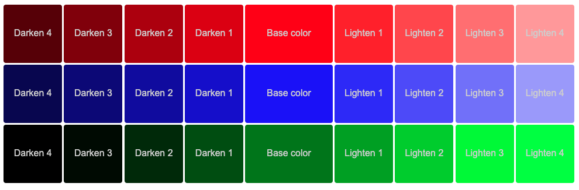

# Exercise 1

The objetive of this exercise is to create a dynamic color palette using Sass

In order to use Sass we need to use a web application bundler. In this project I am using **parcel**.

For testing you should have parcel installed first

```bash
sudo npm install -g parcel-bundler
```

Test the application

```bash
parcel ./src/index.html
```

The result should be something like the image below:



If you want to change the base color change the values of variable ```$colors:``` in file ```_themes.scss```:

```css
$colors: red, blue, green;
```
